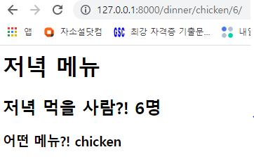

urls.py

```python
urlpatterns = [
    path('dinner/<str:menu>/<int:number>/', views.dinner),
    ]
```


views.py

```python
def dinner(request, menu, number):
    context = {
        'menu' : menu,
        'number' : number,
    }
    return render(request, 'dinner.html', context)

```


templates.dinner.html

```html
<h1>저녁 메뉴</h1>
<h2>저녁 먹을 사람?! {{ number }}명</h2>
<h3>어떤 메뉴?! {{ menu }}</h3>
```


​	