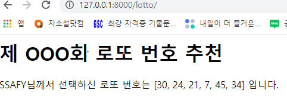

urls.py

```python
urlpatterns = [
    path('admin/', admin.site.urls),
    path('bts/', views.bts),
    path('lotto/', views.lotto),
    path('lunch', views.lunch),
    path('throw/', views.throw),
    path('catch/', views.catch),
    path('hello/<name>/', views.hello),
    path('dinner/<str:menu>/<int:number>/', views.dinner),
    ]
```


views.py

```python
def lotto(request):
    lottos = [i for i in range(1,46)]
    numbers = [i for i in range(1,7)]
    pick = []
    for i in range(6):
        a = random.choice(lottos)
        pick += [a]
        lottos.remove(a)
    context = {'pick' : pick,
            'numbers' : numbers}
    return render(request, 'lotto.html', context)
```


templates/lotto.html

```html
<h1>제 OOO회 로또 번호 추천</h1>
<p>SSAFY님께서 선택하신 로또 번호는 {{pick}} 입니다.</p>
  
```

