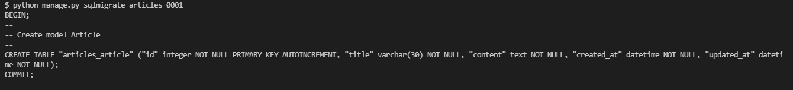

# 1. Model 반영하기

migration


# 2. Model 변경사항 저장하기

```python
article = Article()
article.title = 
article.content = 
article.save()
```

```bash
$ python manage.py sqlmigrate articles 0001
```


# 3. Python Shell

```bash
$ pip install django-extensions
```

```python
INSTALLED_APPS =(
	'django_extensions',
)
```

```bash
$ python manage.py shell_plus
```




# 4. Django Model Field

AutoField

BigAutoField

TextField

CharField

DateField

DateTimeField

EmailField