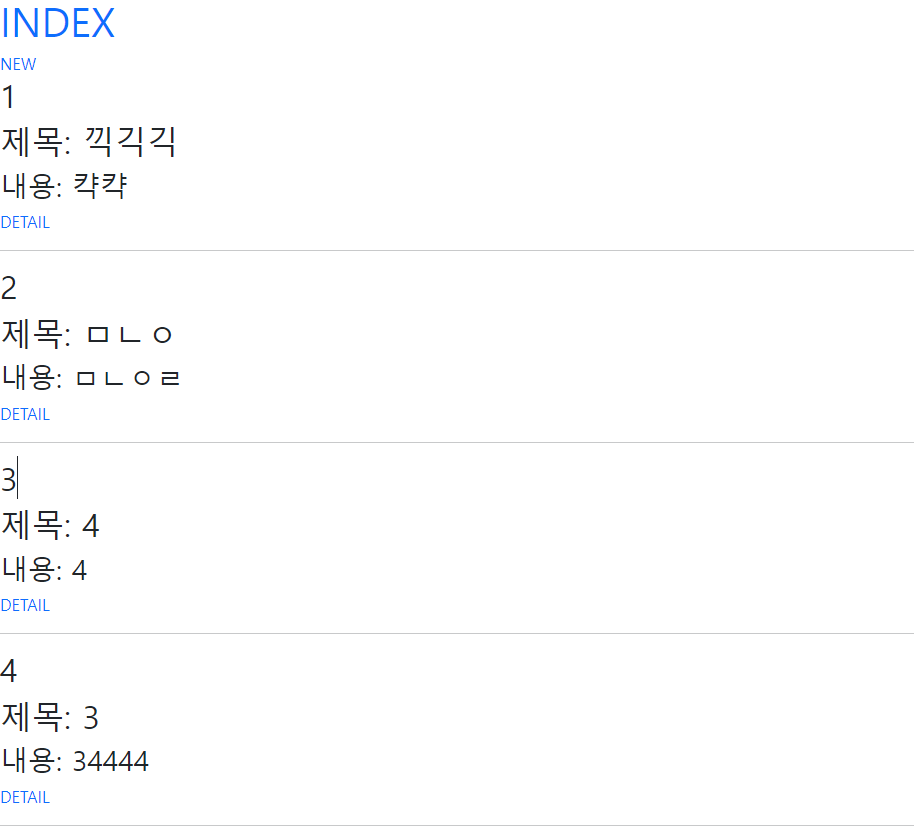
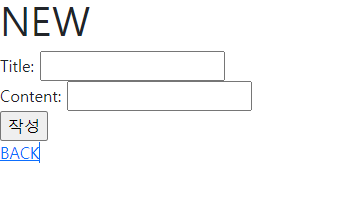

# Read

```python
# urls.py

from django.urls import path
from . import views


app_name = 'articles'

urlpatterns = [
    path('', views.index, name='index'),
    path('new/', views.new, name='new'),
    path('create/', views.create, name='create'),
    path('<int:pk>', views.detail , name='detail'),
    path('<int:pk>/edit', views.edit, name='edit'),
    path('<int:pk>/update', views.update, name='update'),
    path('<int:pk>/delete', views.delete, name='delete'),
]


# views.py

from django.shortcuts import render, redirect
from .models import Article

def index(request):
    articles = Article.objects.all()[::-1]
    
    context = {
        'articles' : articles,
    }
    return render(request, 'articles/index.html', context)

```

```django
# articles/index.html



<h1 class="text-primary">INDEX</h1>
<a href= class="text-primary text-decoration-none">NEW</a>

  <h2>{{ forloop.counter }}</h2>
  <h2>제목: {{ article.title }}</h2>
  <h3>내용: {{ article.content }}</h3>
  <a href= class="text-primary text-decoration-none" >DETAIL</a>
  <hr>



# base.html

<!DOCTYPE html>
<html lang="en">
<head>
  <meta charset="UTF-8">
  <meta http-equiv="X-UA-Compatible" content="IE=edge">
  <meta name="viewport" content="width=device-width, initial-scale=1.0">
  <link href="https://cdn.jsdelivr.net/npm/bootstrap@5.1.3/dist/css/bootstrap.min.css" rel="stylesheet" integrity="sha384-1BmE4kWBq78iYhFldvKuhfTAU6auU8tT94WrHftjDbrCEXSU1oBoqyl2QvZ6jIW3" crossorigin="anonymous">
  <title>Document</title>
</head>
<body>


  <script src="https://cdn.jsdelivr.net/npm/bootstrap@5.1.3/dist/js/bootstrap.bundle.min.js" integrity="sha384-ka7Sk0Gln4gmtz2MlQnikT1wXgYsOg+OMhuP+IlRH9sENBO0LRn5q+8nbTov4+1p" crossorigin="anonymous"></script>
</body>
</html>
```




# Create

```python
# views.py

def new(request):
    return render(request, 'articles/new.html')

def create(request):
    title = request.POST.get('title')
    content = request.POST.get('content')
    article = Article()
    article.title = title
    article.content = content
    article.save()

    return redirect('articles:detail', article.pk)
```

```django




<h1>NEW</h1>
<form action= method="POST">
  
    <label for="title">Title:</label>
    <input type="text" name="title" id="title">
    <br>
    <label for="content">Content:</label>
    <input type="text" name="content" id="content">
    <br>
    <input type="submit" value="작성">
    <br>
    <a href=>BACK</a>
</form>


```

