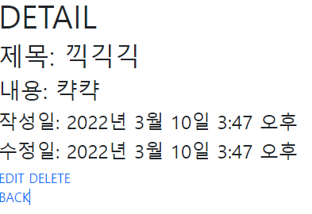
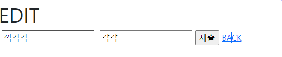

```django
# base.html
<!DOCTYPE html>
<html lang="en">
<head>
  <meta charset="UTF-8">
  <meta http-equiv="X-UA-Compatible" content="IE=edge">
  <meta name="viewport" content="width=device-width, initial-scale=1.0">
  <link href="https://cdn.jsdelivr.net/npm/bootstrap@5.1.3/dist/css/bootstrap.min.css" rel="stylesheet" integrity="sha384-1BmE4kWBq78iYhFldvKuhfTAU6auU8tT94WrHftjDbrCEXSU1oBoqyl2QvZ6jIW3" crossorigin="anonymous">
  <title>Document</title>
</head>
<body>


  <script src="https://cdn.jsdelivr.net/npm/bootstrap@5.1.3/dist/js/bootstrap.bundle.min.js" integrity="sha384-ka7Sk0Gln4gmtz2MlQnikT1wXgYsOg+OMhuP+IlRH9sENBO0LRn5q+8nbTov4+1p" crossorigin="anonymous"></script>
</body>
</html>
```

```python
# crud.urls.py
from django.contrib import admin
from django.urls import path, include

urlpatterns = [
    path('admin/', admin.site.urls),
    path('articles/', include('articles.urls')),
]

# articles.urls.py
from django.urls import path
from . import views


app_name = 'articles'

urlpatterns = [
    path('', views.index, name='index'),
    path('new/', views.new, name='new'),
    path('create/', views.create, name='create'),
    path('<int:pk>', views.detail , name='detail'),
    path('<int:pk>/edit', views.edit, name='edit'),
    path('<int:pk>/update', views.update, name='update'),
    path('<int:pk>/delete', views.delete, name='delete'),
]
```


# Detail

```python
# views.py
def detail(request, pk):
    article = Article.objects.get(pk=pk)
    
    context = {
        'article' : article,   
    }
    return render(request, 'articles/detail.html', context)
```

```django



<h1>DETAIL</h1>
<h2>제목: {{ article.title }}</h2>
<h3>내용: {{ article.content }}</h3>
<h4>작성일: {{ article.created_at }}</h4>
<h4>수정일: {{ article.updated_at }}</h4>
<a href= class="text-decoration-none">EDIT</a> 
<a href= class="text-decoration-none">DELETE</a>
<br>
<a href= class="text-decoration-none">BACK</a>

```




# Update

```python
# views.py
def edit(request, pk):
    article = Article.objects.get(pk=pk)
    content = {
        'article' : article
    }
    return render(request, 'articles/edit.html', content)

def update(request, pk):
    title = request.POST.get('title')
    content = request.POST.get('content')
    article = Article.objects.get(pk=pk)
    article.title = title
    article.content = content
    article.save()
    return redirect('articles:detail', article.pk)
```

```django
# edit.html



<h1>EDIT</h1>
<form action= method="POST">
  
    <label for="title"></label>
    <input type="text" name="title" id="title" value={{ article.title }}>
    <label for="content"></label>
    <input type="text" name="content" id="content" value={{ article.content }}>
    <input type="submit" value="제출">
    <a href=>BACK</a>


```



# Delete

```python
# views.py
def delete(request, pk):
    article = Article.objects.get(pk=pk)
    article.delete()
    return redirect('articles:index')
```

