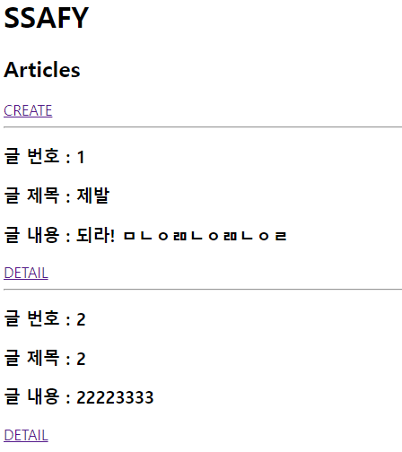
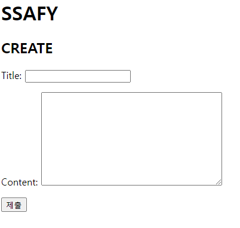
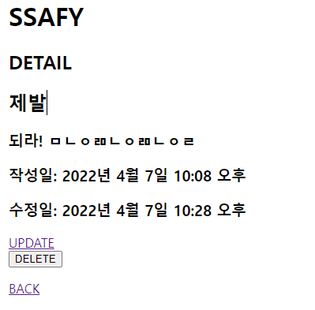
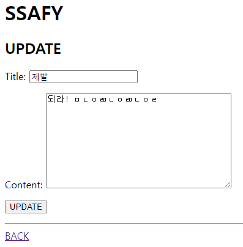

# Form


## url

```python
from . import views
from django.urls import path

app_name = "articles"

urlpatterns = [
    path('', views.index, name="index"),
    path('create/', views.create, name="create"),
    path('<int:pk>/', views.detail, name="detail"),
    path('<int:pk>/update/', views.update, name="update"),
    path('<int:pk>/delete/', views.delete, name="delete"),

]
```


## view

```python
from django.shortcuts import get_object_or_404, render, redirect
from .models import Article
from .forms import ArticleForms

# Create your views here.


def index(request):
    articles = Article.objects.all()
    context = {
        'articles' : articles
    }
    return render(request, 'articles/index.html', context)

def create(request):
    if request.method == 'POST':
        forms = ArticleForms(request.POST)
        if forms.is_valid():
            forms.save()
            return redirect('articles:index')
    else:
        forms = ArticleForms()
    context = {
        'forms' : forms
    }
    return render(request, 'articles/create.html', context)


def detail(request, pk):
    article = get_object_or_404(Article, pk=pk)
    context = {
        'article' : article
    }
    return render(request, 'articles/detail.html', context)

def delete(request, pk):
    article =get_object_or_404(Article, pk=pk)
    article.delete()
    return redirect('articles:index')

def update(request, pk):
    article = get_object_or_404(Article,pk=pk)
    if request.method == 'POST':
        forms = ArticleForms(request.POST, instance=article)
        if forms.is_valid():
            forms.save()
            return redirect('articles:detail', article.pk)
    else:
        forms = ArticleForms(instance=article)
    context = {
        'forms' : forms
    }
    return render(request, 'articles/update.html', context)
```


## model

```python
from django.db import models
from django.forms import CharField, DateTimeField, Textarea

# Create your models here.


class Article(models.Model):
    title = models.CharField(max_length=10)
    content = models.TextField()
    created_at = models.DateTimeField(auto_now_add=True)
    updated_at = models.DateTimeField(auto_now=True)
```


## form

```python
from dataclasses import field
from .models import Article
from django import forms


class ArticleForms(forms.ModelForm):

    class Meta:
        model = Article
        fields = '__all__'
```


## template

```django
# index.html

<h2>Articles</h2>
<a href=>CREATE</a>

<hr>
<h3>글 번호 : {{ article.pk }}</h3>
<h3>글 제목 : {{ article.title }}</h3>
<h3>글 내용 : {{ article.content }}</h3>

<a href=>DETAIL</a>





# create.html


<h2>CREATE</h2>
<form action= method="POST">
  
  {{ forms.as_p }}
  <input type="submit" value="제출">
</form>



# detail.html


<h2>DETAIL</h2>
<h2>{{ article.title }}</h2>
<h3>{{ article.content }}</h3>
<h3>작성일: {{ article.created_at }}</h3>
<h3>수정일: {{ article.updated_at }}</h3>

<a href=>UPDATE</a>
<form action= method='POST'>
  
<input type="submit" value="DELETE">
</form>
<a href=>BACK</a>



# update.html


<h2>UPDATE</h2>
<form action="" method='POST'>
  
  {{ forms.as_p }}
  <input type="submit" value="UPDATE">
</form>
<hr>
<a href=>BACK</a>

```







