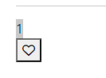
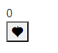

# 좋아요


``` python
# 1. 
# articles/models.py

class Article(models.Model):
    user = models.ForeignKey(settings.AUTH_USER_MODEL, on_delete=models.CASCADE)
    like_users = models.ManyToManyField(settings.AUTH_USER_MODEL, related_name='like_articles')
    title = models.CharField(max_length=10)
    content = models.TextField()
    created_at = models.DateTimeField(auto_now_add=True)
    updated_at = models.DateTimeField(auto_now=True)

    def __str__(self):
        return self.title


class Comment(models.Model):
    article = models.ForeignKey(Article, on_delete=models.CASCADE)
    user = models.ForeignKey(settings.AUTH_USER_MODEL, on_delete=models.CASCADE)
    content = models.CharField(max_length=200)
    created_at = models.DateTimeField(auto_now_add=True)
    updated_at = models.DateTimeField(auto_now=True)

    def __str__(self):
        return self.content
  
# articles/urls.py    
app_name = 'articles'
urlpatterns = [
    path('<int:article_pk>/like/', views.like, name='like'),
]
        
# articles/views.py

@require_POST
def like(request, article_pk):
    # 로그인되어 있으면
        # 눌렀는지 안눌렀는지
    user = request.user
    if user.is_authenticated:
        article = get_object_or_404(Article, pk=article_pk)
        if article.like_users.filter(pk=user.pk).exists():
            article.like_users.remove(user)
        else:
            article.like_users.add(user)
        return redirect('articles:index')
    return redirect('accounts:login')
```


```django
{{ article.like_users.all |length }}
<form action="" method="POST">
    
    
    <button><i class="fa-regular fa-heart"></i></button>
    
    <button><i class="fa-solid fa-heart"></i></button>
    
</form>
```

* 좋아요 누른 상태



* 좋아요 안누른 상태

