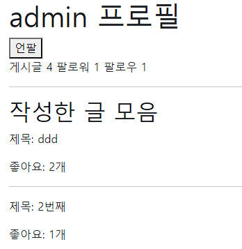
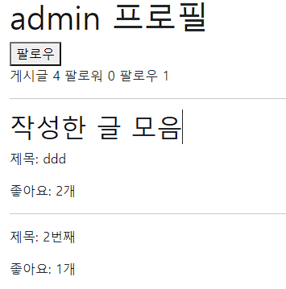

# 팔로우


```python
# 1. accounts/models.py

class User(AbstractUser):
    followings = models.ManyToManyField('self', symmetrical=False, related_name='followers')
    
# 2. accounts/urls.py

app_name = 'accounts'
urlpatterns = [
    path('<username>/', views.profile, name='profile'),
    path('<int:user_pk>/follow/', views.follow, name='follow'),
]

# accounts/views.py

def profile(request, username):
    user = get_object_or_404(get_user_model(), username=username)
    context = {
        'user': user
    }
    return render(request, 'accounts/profile.html', context)

@require_POST
def follow(request, user_pk):
    me = request.user
    you = get_object_or_404(User, pk=user_pk)
    if me.is_authenticated:
        if you != me:
            if you.followers.filter(pk=me.pk).exists():
                you.followers.remove(me)
            else:
                you.followers.add(me)
            return redirect('accounts:profile', you.username)
        return redirect('articles:index')
    return  redirect('accounts:login')
```


3. template

```django



  <h1>{{ user.username }} 프로필</h1>
  <form action= method="POST">
    
    
      <button>언팔</button>
    
      <button>팔로우</button>
    
  </form>

  <span>게시글 {{ user.article_set.all| length}}</span>
  <span>팔로워 {{ user.followers.all | length}}</span>
  <span>팔로우 {{ user.followings.all | length}}</span>

  <hr>
  <h2>작성한 글 모음</h2>
  
    <p>제목: {{ article.title }}</p>
    <p>좋아요: {{ article.like_users.all|length }}개</p>
    <hr>
  
  <h2>작성한 댓글 모음</h2>
  
    <p>{{ comment.content }}</p>
  

```

* 팔로우 했을 시



* 팔로우 x

