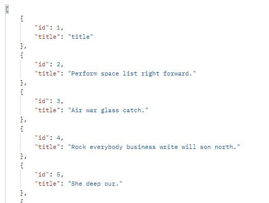

# Django REST Framework


```python
# articles/serializers.py

class ArticleSerializer(serializers.ModelSerializer):
   
    class Meta:
        model = Article
        fields = '__all__'


class ArticleListSerializer(serializers.ModelSerializer):

    class Meta:
        model = Article
        fields = ('id', 'title',)

        
        
# articles/views.py

@api_view(['GET', 'POST'])
def article_list(request):
    if request.method == 'GET':
        article = get_list_or_404(Article)
        serializer = ArticleListSerializer(article, many=True)
        return Response(serializer.data)
    elif request.method =='POST':
        serializer = ArticleSerializer(data=request.data)
        if serializer.is_valid(raise_exception=True):
            serializer.save()
            return Response(serializer.data, status=status.HTTP_201_CREATED)
        return Response(serializer.data, status=status.HTTP_400_BAD_REQUEST)


@api_view(['GET', 'DELETE', 'PUT'])
def article(request, pk):
    article = get_object_or_404(Article, pk=pk)
    if request.method == 'GET':
        serializers = ArticleSerializer(article)
        return Response(serializers.data)
    elif request.method == "DELETE":
        article.delete()
        data = {
            'delete' : f'데이터 {pk}번이 삭제되었습니다.'
        }
        return Response(data, status=status.HTTP_204_NO_CONTENT)
    elif request.method == "PUT":
        serializers = ArticleSerializer(article, data=request.data)
        if serializers.is_valid(raise_exception=True):
            serializers.save()
            return Response(serializers.data)
```

* 모든 게시글 GET




* Create POST


* 특정 게시글 GET


* PUT & DELETE


